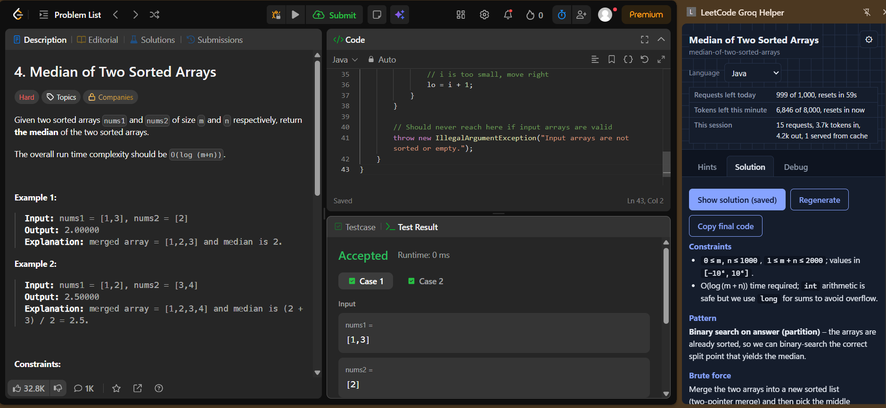

# LeetCode Groq Helper
   
A Chrome extension (Manifest V3) that reads the LeetCode problem you have open and gives you
progressive hints, full solutions with complexity, and bug finding, using the Groq API free tier.

## Features
- **Hints:** 3 steps (pattern, key insight, pseudo-code), one at a time
- **Solution:** brute force, optimized approach, time/space complexity, code in Java, Python, C or JavaScript
- **Debug:** paste your code or a failing test case and it finds the bug
- **Retry with feedback:** send a failing test back with the previous code
- Streaming answers, saved answers (repeat views cost no requests), rate-limit display with a countdown
- Copy button only. It never types or submits into LeetCode for you.

## Install
1. Download or clone this repo.
2. Open `chrome://extensions` and turn on **Developer mode**.
3. Click **Load unpacked** and select this folder (the one with `manifest.json`).
4. Get a free key at https://console.groq.com/keys.
5. Open the extension's **Options** page, paste the key, choose a model, and click **Save**.
6. Open a problem on leetcode.com and click the extension icon.

## How it works
Content script reads the problem, the side panel shows the UI, and a background service worker
sends streaming requests to Groq. Details:
- `content/` reads the problem and detects page navigation
- `background/` holds the request queue, prompts, cache and Groq client
- `panel/` is the side panel
- `options/` is the settings page

## Notes
- Your API key is stored only in `chrome.storage.local` in your browser and is never in this repo.
- Model answers can be wrong. Always test the code yourself.
- Made for practice and learning.